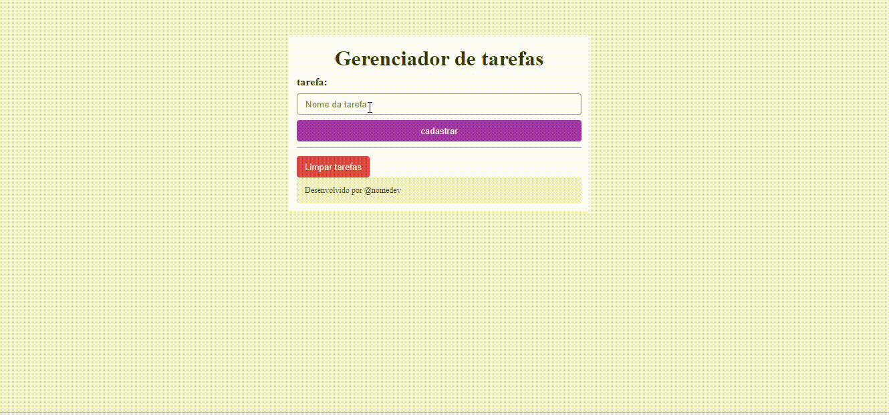

# o que é

Este repositório contém uma aplicação simples de gerenciador de tarefas desenvolvida em PHP, HTML5 e CSS3 GITHUB, seguindo o tutorial do canal Monolito PHP no YouTube.

**Autor do Código:** Monolito PHP  
**Vídeo Tutorial:** [Projeto - Gerenciador de Tarefas](https://www.youtube.com/watch?v=dJ49I-QYYUk&ab_channel=MonolitoPHP)

## Recursos PHP Utilizados

Durante o desenvolvimento desta aplicação, foram utilizados diversos recursos da linguagem PHP para garantir o funcionamento correto do gerenciador de tarefas. Abaixo estão alguns dos principais recursos utilizados e uma breve explicação de cada um:

 **isset**: é utilizada para verificar se uma variável foi definida e não é nula. Isso é especialmente útil ao lidar com formulários e dados enviados pelo usuário.

**$SESSION**:  é uma variável  que permite armazenar dados de sessão do usuário entre diferentes páginas. Isso é útil para manter informações como o estado de login do usuário ou preferências específicas.

 **foreach**: é utilizada para repetir sobre arrays e objetos em PHP. É uma forma de passar todos os elementos de um array sem a necessidade de índices numéricos.

 **session_start()**: é utilizada para começar uma nova sessão ou retomar uma sessão existente no servidor. Isso é essencial para trabalhar com dados de sessão no PHP.

 **array()**:  é utilizada para criar um novo array em PHP.

 **$_GET**: é uma variável que contém os padrões passados para o script via método GET. Isso é utilizado para passar dados através de URLs.

 **array_push()**: é utilizada para adicionar um ou mais elementos ao final de um array. Isso é útil quando precisamos adicionar novos dados frequentimente a um array já existente.

 **var_dump()**: é utilizada para exibir informações estruturadas sobre uma variável, incluindo o tipo e o valor. É uma ferramenta útil para  entender o conteúdo das variáveis.

 **unset()**: é utilizada para remover uma variável específica ou um elemento de um array. Isso é útil para liberar memória ou limpar dados não mais necessários.

Esses são alguns dos recursos essenciais em PHP utilizados na construção do gerenciador de tarefa.

## Como Utilizar

1. Clone este repositório em sua máquina local.
2. Configure seu servidor web para executar arquivos PHP.
3. Abra o arquivo `index.php` em seu navegador para acessar a aplicação.

## link

[linkedin](https://www.linkedin.com/posts/amanda-vitoria-08600a299_hoje-dia-29-de-abril-realizei-uma-atividade-activity-7190698784627048448-nv5w?utm_source=share&utm_medium=member_desktop)

